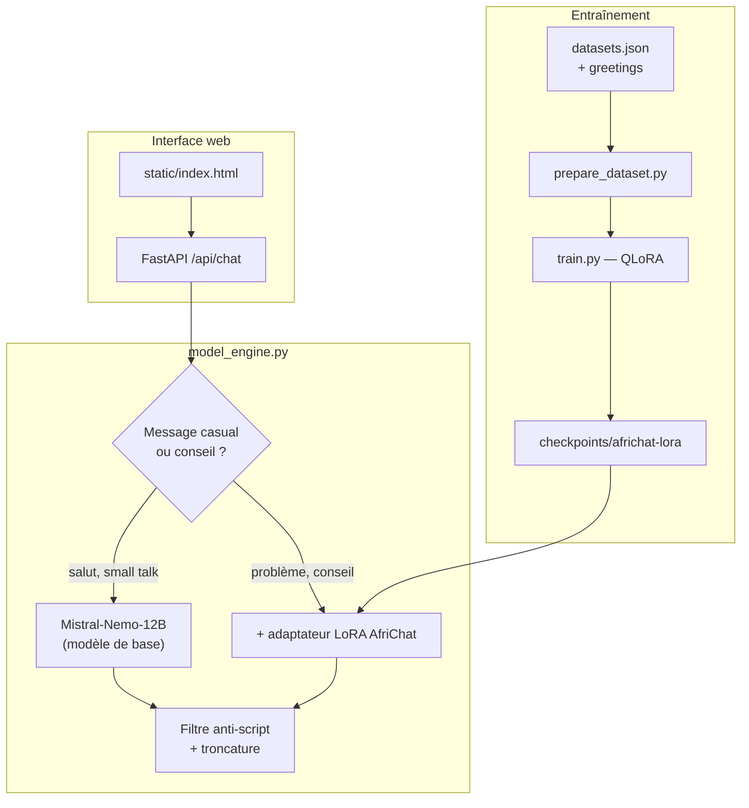

# AfriChat

**Ton gars d'Abidjan dans ta poche** — un chatbot francophone africain fine-tuné sur **Mistral-Nemo-12B-Instruct**, qui parle comme un vrai pote : nouchi, camfranglais, expressions de Lomé, taquineries de tonton et conseils cash.

> *« Foot, bouffe, boulot, life — on parle de tout. »*

---

## Pourquoi AfriChat ?

Les LLM généralistes répondent souvent en français « métropolitain » formel. AfriChat vise un registre **oral, chaleureux et culturellement ancré** en Afrique francophone :

| Registre | Exemple |
|----------|---------|
| **Nouchi** (Côte d'Ivoire) | *« Eh mon gars ! C'est comment ? »* |
| **Camfranglais** | *« For real, ça va today ? »* |
| **Lomé** | *« Molo molo, on palabre. »* |
| **Générique** | *« Ça va hein, on se bat. Et toi ? »* |

Le modèle ne fait pas le professeur de proverbes : il **chambre un peu**, **rebondit** sur ce que tu dis, et répond comme sur WhatsApp avec un grand frère.

---

## Aperçu

```
Toi      : Bonjour
AfriChat : Salut frérot ! Ça va ? Qu'est-ce qui t'amène ?

Toi      : Et toi ?
AfriChat : Moi ça va hein, tranquille. On discute de quoi aujourd'hui ?

Toi      : Tonton eh, rester motivé ça me tue
AfriChat : Waouh, c'est maintenant que tu te réveilles avec ça toi ?
           Bon bon, viens qu'on regarde ça sérieusement...
```

Interface web sombre style « tonton WhatsApp », accessible en local via tunnel SSH depuis un cluster GPU.

---

## Architecture



### Inférence intelligente à deux vitesses

| Type de message | Moteur | Pourquoi |
|-----------------|--------|----------|
| Salutations, « ça va », « et toi ? » | **Base Mistral** + prompt AfriChat | L'adaptateur LoRA pousse trop vers le script « tonton conseil » appris à l'entraînement |
| Vraies questions, galères, conseils | **Base + LoRA AfriChat** | Style taquin et registre africain du fine-tuning |

Résultat : des salutations **variées** (vrai LLM) et un style AfriChat **préservé** sur les sujets sérieux.

---

## Stack technique

| Composant | Technologie |
|-----------|-------------|
| Modèle de base | [`mistralai/Mistral-Nemo-Instruct-2407`](https://huggingface.co/mistralai/Mistral-Nemo-Instruct-2407) (12B) |
| Fine-tuning | QLoRA 4-bit (`peft`, `bitsandbytes`) |
| Entraînement | `transformers.Trainer` |
| Serveur | FastAPI + Uvicorn |
| Interface | HTML/CSS/JS vanilla (streaming SSE) |
| Déploiement | SLURM sur cluster GPU (Tesla P100 16 Go) |

---

## Dataset

**555 conversations** multi-tours au format JSONL, réparties sur 4 registres :

| Registre | Conversations |
|----------|---------------|
| Nouchi | 143 |
| Générique | 146 |
| Camfranglais | 134 |
| Togo / Lomé | 132 |

Chaque entrée contient :

```json
{
  "theme": "rester motivé",
  "register": "nouchi",
  "discussion": [
    {"role": "user", "content": "Tonton eh, rester motivé ça me tue..."},
    {"role": "assistant", "content": "Ehh, tu es sérieux là ou tu blagues ?"},
    {"role": "user", "content": "Bon... peut-être oui."},
    {"role": "assistant", "content": "Ok ok, calme-toi, Tonton est là."},
    {"role": "assistant", "content": "Retiens ça : sans but tu ne peux pas atteindre ta cible."}
  ]
}
```

Fichiers :

- `datasets.json` — corpus principal (conseils, vie quotidienne, taquineries)
- `datasets_greetings.json` — 23 exemples de salutations et small talk (dont multi-tours « et toi ? »)
- `datasets_ivoirien.json` — ancien corpus court (référence)

---

## Structure du projet

```
africhat/
├── app.py                  # API FastAPI + chargement du modèle
├── model_engine.py         # Inférence (base / LoRA, filtrage, streaming)
├── prompts.py              # Prompts système et marqueurs anti-script
├── prepare_dataset.py      # Conversion JSONL → format chat Mistral
├── train.py                # Fine-tuning QLoRA
├── chat_infer.py           # Test CLI rapide
├── build_ivoirien_dataset.py
├── static/
│   └── index.html          # Interface chat
├── datasets.json
├── datasets_greetings.json
├── train_africhat.slurm    # Job SLURM entraînement (7 jours)
├── run_server.slurm        # Job SLURM serveur web
├── deploy.sh               # rsync vers le cluster
├── connect.sh              # Tunnel SSH → localhost:7860
└── requirements.txt
```

---

## Installation

### Prérequis

- Python 3.11+
- GPU NVIDIA avec ≥ 16 Go VRAM (entraînement et inférence 4-bit)
- Compte Hugging Face (accès à Mistral-Nemo)

### Environnement local

```bash
git clone https://github.com/KELI-Kekeli-Christ/africhat.git
cd africhat

python3 -m venv .venv
source .venv/bin/activate
pip install -r requirements.txt
```

---

## Entraînement

### 1. Préparer le dataset

```bash
python prepare_dataset.py \
  --input datasets_greetings.json \
  --input datasets_greetings.json \
  --input datasets_greetings.json \
  --input datasets.json \
  --output-dir data \
  --val-ratio 0.1 \
  --seed 42
```

Les salutations sont répétées ×3 pour mieux équilibrer le corpus (dominé par les conversations « conseil »).

### 2. Lancer le fine-tuning

```bash
python train.py \
  --model-name mistralai/Mistral-Nemo-Instruct-2407 \
  --train-file data/train.jsonl \
  --val-file data/val.jsonl \
  --output-dir checkpoints/africhat-lora \
  --epochs 4 \
  --batch-size 1 \
  --grad-accum 8 \
  --learning-rate 2e-4 \
  --max-seq-length 1536
```

Sur un cluster SLURM :

```bash
sbatch train_africhat.slurm
```

### Hyperparamètres LoRA

| Paramètre | Valeur |
|-----------|--------|
| `r` | 64 |
| `alpha` | 128 |
| `dropout` | 0.05 |
| Cibles | `q_proj`, `k_proj`, `v_proj`, `o_proj`, `gate_proj`, `up_proj`, `down_proj` |
| Quantization | 4-bit NF4, double quant |

L'adaptateur final fait ~870 Mo.

---

## Inférence

### CLI

```bash
python chat_infer.py \
  --adapter-path checkpoints/africhat-lora \
  --question "Tonton eh, rester motivé ça me tue, aide-moi un peu."
```

### Serveur web

```bash
export AFRICHAT_ADAPTER=checkpoints/africhat-lora
python app.py
# → http://localhost:7860
```

Variables d'environnement utiles :

| Variable | Défaut | Description |
|----------|--------|-------------|
| `AFRICHAT_PORT` | `7860` | Port du serveur |
| `AFRICHAT_HOST` | `0.0.0.0` | Interface d'écoute |
| `AFRICHAT_BASE_MODEL` | `mistralai/Mistral-Nemo-Instruct-2407` | Modèle de base |
| `AFRICHAT_ADAPTER` | `checkpoints/africhat-lora` | Chemin adaptateur LoRA |

---

## Déploiement sur cluster GPU

Le projet inclut des scripts pour un déploiement sur cluster GPU (SLURM + tunnel SSH).

```bash
# 1. Configurer deploy.sh (user, host, chemin distant)
./deploy.sh

# 2. Sur le cluster
sbatch run_server.slurm

# 3. Depuis ton PC — tunnel SSH
./connect.sh
# Ouvre http://localhost:7860
```

`connect.sh` lit automatiquement `logs/server.info` sur le cluster pour trouver le nœud et le port.

---

## API

### `GET /api/health`

```json
{
  "status": "ok",
  "model": "mistralai/Mistral-Nemo-Instruct-2407",
  "adapter": "checkpoints/africhat-lora"
}
```

### `POST /api/chat`

```json
{
  "messages": [
    {"role": "user", "content": "Ça va ?"}
  ],
  "stream": true,
  "max_new_tokens": 96,
  "temperature": 0.82,
  "top_p": 0.92
}
```

Réponse streaming (SSE) : `data: {"content": "..."}` puis `data: [DONE]`.

---

## Limites connues

- **Script d'entraînement** : le corpus conseil suit souvent le schéma *taquinerie → fausse réplique user → proverbe*. Des filtres en inférence limitent ce comportement, mais un ré-entraînement avec plus de diversité reste la meilleure piste.
- **VRAM** : Mistral-Nemo 12B en 4-bit nécessite un GPU décent ; le P100 16 Go fonctionne.
- **Registre** : le mélange nouchi / camfranglais / Lomé peut varier selon le prompt ; le modèle ne « détecte » pas automatiquement ton pays.

---

## Feuille de route

- [ ] Publier l'adaptateur LoRA sur Hugging Face
- [ ] Enrichir le dataset (foot, bouffe, culture, multi-pays)
- [ ] Support voix / audio (whisper + TTS)
- [ ] Mode « registre forcé » (nouchi / camfranglais / Lomé)
- [ ] Évaluation automatique du style (benchmark francophone africain)

---

## Contribuer

Les PR sont les bienvenues — surtout pour :

- Nouvelles conversations dans les 4 registres
- Exemples de small talk naturel (pas que des conseils)
- Corrections de filtres d'inférence
- Traductions / variantes (Sénégal, Cameroun, RDC…)

```bash
# Format attendu pour une nouvelle entrée dataset
{"theme": "...", "register": "nouchi|camfranglais|togo_lome|generic", "discussion": [...]}
```

---

## Licence

MIT — voir [LICENSE](LICENSE).

Le modèle de base [Mistral-Nemo-Instruct](https://huggingface.co/mistralai/Mistral-Nemo-Instruct-2407) est soumis à sa propre licence Apache 2.0.

---

## Auteur

**[KELI-Kekeli-Christ](https://github.com/KELI-Kekeli-Christ)** — projet personnel open source.

Si AfriChat t'a fait sourire, ⭐ sur le repo !
